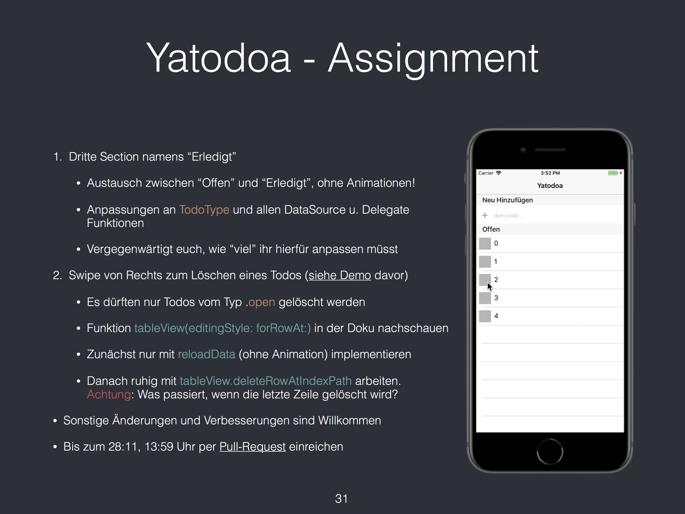
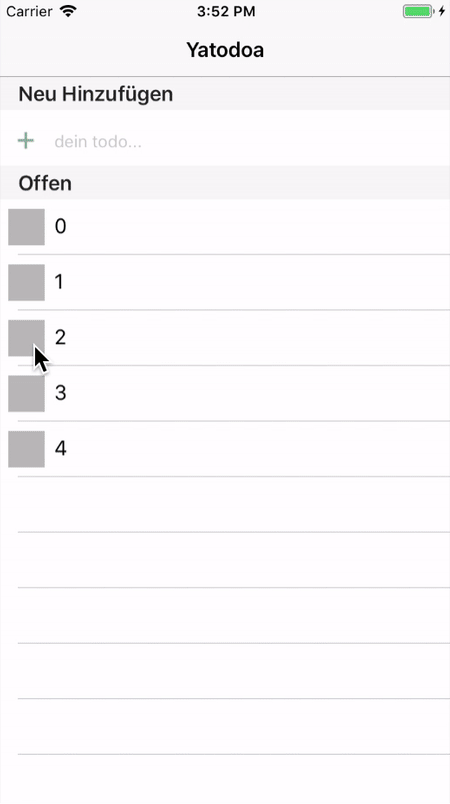
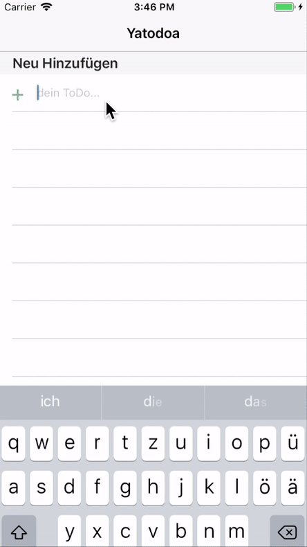

# FSIOS im WS 17/17

## Organisatorisches
Hier bitte eure Assignments ablegen und bis zum nächsten Termin, **28.11 - 13:59 Uhr**, als Pull-Reuqest einreichen. Das Projekt bitte in einem Verzeichnis ablegen, der eurem Namen entspricht. **Schaut euch ebenfalls [Assignment Gif](assignment_04.gif) und [Demo Gif](demo.gif) an**

Beachtet, dass ihr

* die dritte Section wie im [Assignment](assignment_04.png) beschrieben und
* das Löschen (**nicht** Favorisieren) implementiert müsst, wie im [Demo Gif](demo.gif) zu sehen ist. Hier erstmal ohne und dann anschließend mit Animation. Falls ihr die Animation nicht ohne Fehler schafft, ist es auch OK.

## Assignment
Aufgabe und Screenshot

Gif

